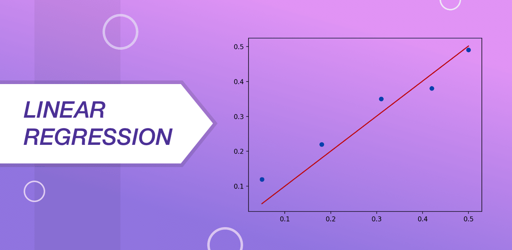
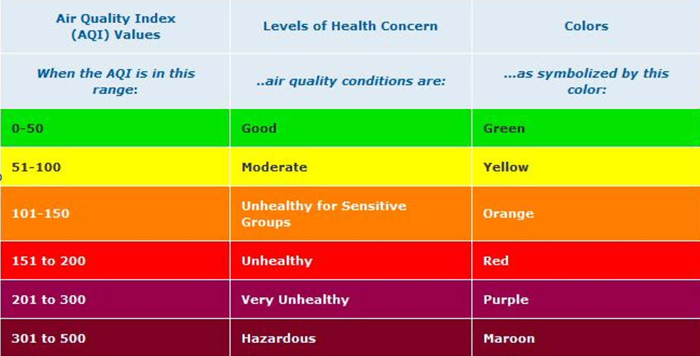
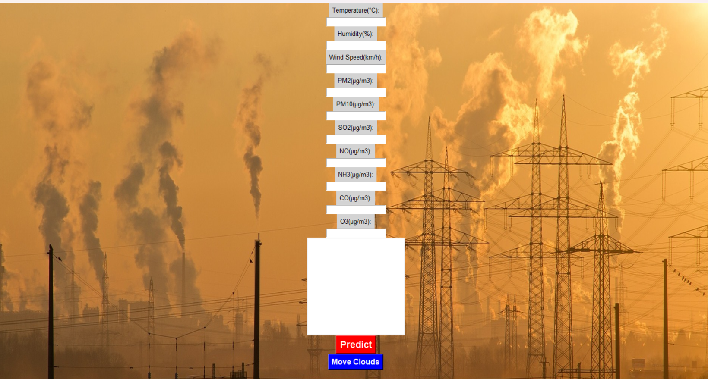
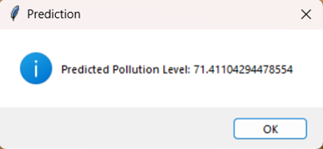

# Air_Pollution_Prediction
In this project work, the main motive is to build a machine learning model to detect air pollution. In order to achieve that goal, we have collected data and then calculate air pollution using linear regression model and add some graphical user interface (GUI) for better understanding.
 
Here are a few visual glimpses extracted from the model.

  
